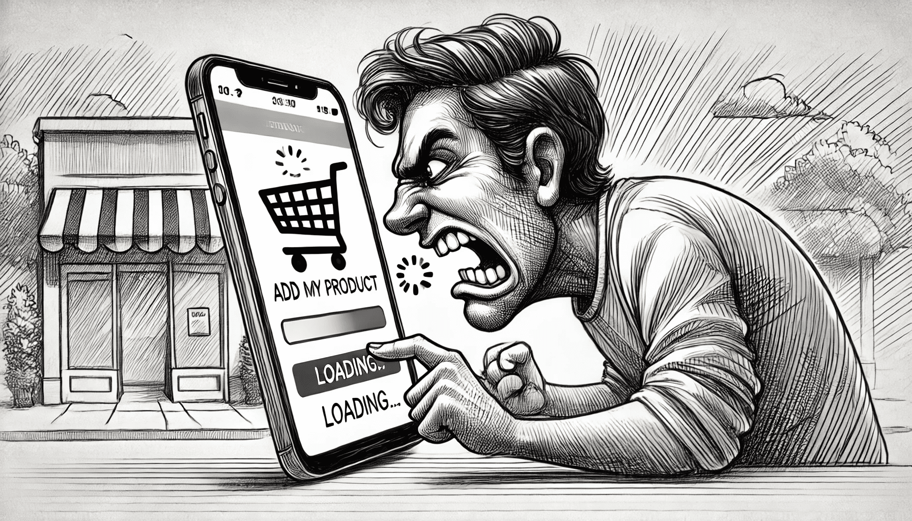

# Solving the Delayed Cart Update Issue

## The Story: The Frustrated Customer

Imagine a customer, eager to purchase a product they've just found on your e-commerce site. They pick up their phone, select the item, and tap "Add to Cart." But something unexpected happens—the product doesn't appear in the cart immediately. Seconds tick by, and the customer starts feeling frustrated. They wonder if their action went through. Is it their internet connection? Is there something wrong with the app? They tap again, still no confirmation. Finally, they give up and leave, possibly abandoning their purchase altogether.

This story illustrates a common problem: **delayed feedback in online transactions**. When a server is far away, or when there are network issues, the customer may not see the result of their action immediately, causing confusion and discouragement. It’s a frustrating experience, and it’s one we want to avoid at all costs.

So, how do we solve it?

## The Solution: Optimistic Updates and Retry Mechanisms

To give customers a smoother, frustration-free experience, we can implement two powerful techniques: **optimistic updates** and **retry logic**. Let’s break down how these strategies work in practice.

### 1. Optimistic Updates: Acting Confidently

With optimistic updates, instead of waiting for a response from the server, we **immediately show the customer that the product has been added to the cart**. It's like saying, "Don't worry, we got this!" As soon as the customer taps that button, the app displays the product in their cart as if the action was already successful.

Behind the scenes, the request to the server is still in progress. But because we show the result optimistically, the customer feels the app is responsive and fast. If the server confirms the action, we’re all set. If something goes wrong, we can gracefully handle that too (by showing an error message or reverting the cart).

### 2. Retry Mechanism: Never Give Up

What happens if the request to add the product fails? Maybe the server is slow, or there’s a temporary network hiccup. Instead of giving up, we implement a **retry mechanism**. This means that the app will automatically try to resend the request a few times before declaring a failure.

By retrying, we increase the chances that a temporary issue won’t lead to a permanent failure. The customer may never even notice there was a problem, and they’ll be happily on their way to checkout without frustration.

### Combining Both for the Best Experience

Using optimistic updates and retry logic together creates a seamless, fast, and reliable user experience. The optimistic update gives the user immediate feedback, while the retry mechanism ensures that temporary failures don’t result in abandoned carts.

---

## The Developer's Task: Implement the Solution

Now that we know what’s causing the issue and how to solve it, it’s your turn to jump in and bring this solution to life! Here's your mission:

### Step-by-Step Guide:

1. **Implement Optimistic Updates:**

    - When the user adds a product to the cart, immediately show the product as "added" in the UI.
    - Don’t wait for the server response to display this update.

2. **Add Retry Logic:**

    - If the request to the server fails (e.g., due to a network timeout or server lag), implement automatic retries.
    - Try sending the request multiple times before showing an error message to the user.

### Assignment

[Check React Query assignment by this link](./react-query.md)

[Check RTK Query assignment by this link](./rtk-query.md)

---

By combining optimistic updates with retries, you'll turn a frustrating experience into a smooth, enjoyable one. Your users will feel like the app is responsive, even if the network or server isn’t cooperating perfectly. It’s a small change with a big impact on user satisfaction.

Now it’s time to make that cart experience the best it can be!
